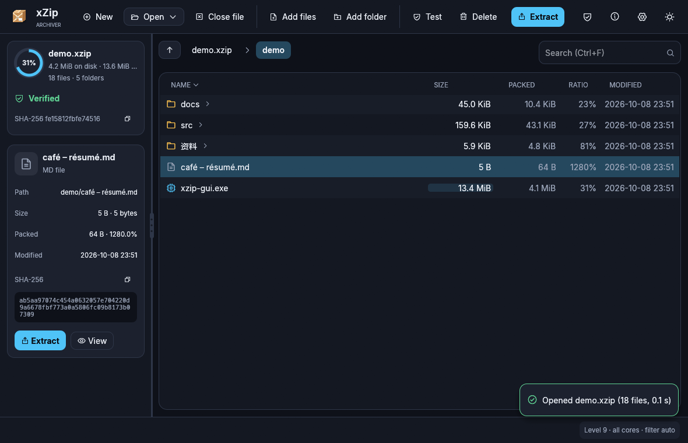

# xZip Archiver

A fast, verified archiver. `.xzip` archives hold standard `.xz` streams inside a
container that is hashed before it is parsed, with an extractor that closes the
holes other formats have been bitten by for twenty years. Native binaries for
Windows, Linux and macOS (Intel and Apple Silicon); one desktop app, one command
line tool, no runtime to install.



## What you get

- **Fast-LZMA2 compression, written from scratch.** A radix match finder, a fast
  greedy parser and an optimal parser, automatic context tuning, parallel
  encoding across all cores. Output is plain `.xz` inside, so the streams are
  readable by `xz`, 7-Zip and liblzma. Levels 6+ typically beat `xz -9e` on binaries.
- **Verified before parsed.** The whole archive is SHA-256 hashed and compared
  with its trailer before a single header field is read. Then the header CRC,
  then the manifest hash, then every field's bounds and every path. A file's
  stream is hashed before decompression and its contents hashed before they are
  written. A flipped bit anywhere means the archive is refused, not half-read.
- **Hardened extraction.** No path traversal, absolute paths, drive letters,
  device names, invisible characters, case collisions or planted links can make
  a file land outside the destination; sizes are declared and enforced, so a
  decompression bomb is refused before it is built. Details below.
- **Paths up to 65,535 bytes.** Long paths work on Windows too.
- **A desktop app that behaves like a file manager.** Browse folders inside an
  archive, drag and drop to add, extract a selection, test, delete, view, sort,
  search, dark and light themes, native dialogs, a details pane with hashes.
- **A command line that follows the conventions you already know** (7z-style
  subcommands, tar-style `-C` and `--strip-components`, xz-style `-l 0..9`),
  with `--json`, proper exit codes, shell completions and a man page.

## Install

Grab the archive for your platform from the Releases page, verify it against
`SHA256SUMS.txt`, and unpack:

| Platform | Contents |
|---|---|
| Windows x86_64 | `xzip.exe`, `xzip-gui.exe`, PowerShell completions |
| Linux x86_64 | `xzip`, `xzip-gui`, completions, man page, `.desktop` file |
| macOS Intel / Apple Silicon | `xzip`, `xZip Archiver.app`, completions, man page |

Linux: the desktop app uses OpenGL and GTK 3 for file dialogs (`libgtk-3`,
`libxkbcommon`, `libgl1`), which every mainstream desktop already has.
macOS: the app is not notarized yet; right-click → Open the first time, or
`xattr -d com.apple.quarantine "xZip Archiver.app"`.

## Command line

```
xzip a  backup.xzip ~/Documents -l 7          # create (or add to) an archive
xzip x  backup.xzip -C /tmp/restore            # extract everything
xzip x  backup.xzip 'Documents/**/*.pdf' -C ./pdfs --strip-components 1
xzip l  backup.xzip --long                     # list with packed sizes and hashes
xzip t  backup.xzip                            # verify every file
xzip d  backup.xzip Documents/old              # remove entries (no recompression)
xzip i  backup.xzip                            # archive details
xzip a  - src --files-from list.txt > out.xzip # archive to stdout
xzip completions zsh > ~/.zfunc/_xzip          # bash, zsh, fish, powershell, elvish
xzip man > xzip.1
```

Useful flags: `-l 0..9` level, `-T N` threads, `-x GLOB` exclude (repeatable;
matches names, paths or parent folders), `--include GLOB`, `-C DIR`, `-f` replace
existing files on extract (default is to keep them and warn), `--dry-run`,
`--json` for scripts, `-q` / `-v`, `--no-progress`, `--color auto|always|never`.
`NO_COLOR` is respected. Progress bars only appear on a terminal.

Exit codes: `0` success · `1` finished with warnings (skipped files) · `2` usage
error · `3` integrity failure (refused) · `4` I/O or other error · `130` interrupted.

## The desktop app

Open an archive (or pass it on the command line / double-click a `.xzip` file),
browse it like a folder, and:

- drop files or folders onto the window to add them (or to create a new archive)
- select with click, Ctrl+click and Shift+click; right-click for a context menu
- Extract all or just the selection, choose to replace existing files or keep them
- Test decodes every file and checks every hash
- View shows text or a hex dump without extracting
- the details pane shows sizes, dates and the SHA-256 of any file
- Ctrl+O open · Ctrl+N new · Ctrl+F search · Backspace up · Delete remove · Esc cancel

## Security: what is checked and refused

**Before anything is shown.** Whole-file SHA-256 against the trailer, header
CRC32, manifest SHA-256, strict bounds on every field (entry counts, offsets,
lengths, sizes, timestamps), streams that must sit back to back inside the
payload with no overlap or gap, and every path validated. Any failure refuses
the archive entirely.

**Paths.** Rejected at creation and at extraction, on every platform, so an
archive made anywhere extracts safely everywhere: `..`, absolute paths, drive
letters, backslashes, control and NUL characters, invisible/bidirectional
characters used for name spoofing, Windows device names (`CON`, `NUL.txt`,
`COM1`), trailing dots and spaces, names over 255 bytes, paths over 65,535
bytes, two entries that differ only by case or Unicode normalization, a file
where a folder is needed.

**Writing.** Every path is validated before the first byte is written. Folders
are created one level at a time with `mkdir` and proven by canonical path to be
real folders inside the destination, so a symlink or junction planted in the
destination cannot redirect a write. Each file is created with create-new
semantics (the open fails if anything already exists there), so a write never
goes through an existing file or link; existing files are kept unless you ask to
replace them, and links and folders are never replaced. Sizes are enforced
(a stream must produce exactly its declared size), per-file and total caps
apply, and free disk space is checked up front. The format stores regular files
and folders only: no links, devices or special permissions can be smuggled in.

**The program itself.** Rust, `#![forbid(unsafe_code)]` in the core, every
untrusted length bounds-checked, no allocation sized from untrusted input
without a cap, overflow checks on in release builds, dependencies audited in CI.

**What hashes do not do.** They catch corruption and modification by anyone who
does not recompute them. They do not prove who made an archive; that would need
a signature over the trailer hash with a key the verifier holds. The format
reserves exactly that value for it.

## Archive format

```
Header   64 B    magic "XZIP\0\x01", version, flags, manifest offset and length,
                 SHA-256 of the manifest, CRC32 of the header
Payload          one .xz stream per file, back to back
Manifest         entry count, then per entry: kind, flags, mtime, UTF-8 path
                 (≤ 65535 bytes); files add method, stream offset and length,
                 uncompressed size, SHA-256 of the stream, SHA-256 of the contents
Trailer  48 B    magic "XZIPEND\0", SHA-256 of everything before it, total length
```

All integers little-endian. Paths are `/`-separated and NFC-normalized.

## Building

```
cargo build --release --workspace
cargo test --workspace --release
```

Rust 1.85 or newer. Linux needs the GTK 3 and X11/Wayland development packages
listed in `.github/workflows/ci.yml`. Releases are built by the `Release`
workflow: push a tag like `v0.1.0`, or run it from the Actions tab with a tag
name, and every platform is built, packaged with checksums and published.

## Layout

```
crates/xzip-core   compressor (rangecoder, lzma, radix, optimal, lzma2, xz) and the archive format
crates/xzip-cli    the xzip command
crates/xzip-gui    the desktop app (egui)
```

## Author

Clinton Turner. All rights reserved; see `LICENSE`. Third-party components and
their licenses are listed in `THIRD_PARTY.md`.
